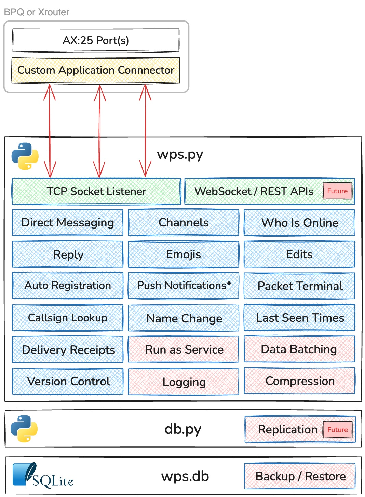

# WPS - A Messaging Service and Protocol for Packet Radio

WPS is a backend service and protocol that provides messaging services over Packet Radio. Currently built to interface with a BPQ or Xrouter node, WPS is directly exposed to the AX:25 packet network and can be systematically accessed by end user applications that implement its protocol. 

WPS was built specifically to enable the functionality in the WhatsPac front end, but implements a protocol that could be used by any Packet Radio messaging application.

WPS is capable of operating effectively over 1200 baud links or greater and without any internet dependency.

WPS runs entirely in Python, starts with just three files, has minimal dependencies, minimal setup and runs with single command. It can be run manually or as a service

> [!IMPORTANT]
> WPS is in active development and is changing on a regular basis - please remember to watch the repo to be alerted when there are new versions

## Overview and Setup
1. [WPS Schematic](#wps-schematic)
2. [Key functions](#key-functions)
3. [Server Capabilities](#server-capabilities)
4. [How WPS Works - An Overview](#how-wps-works---an-overview)
5. [WPS Installation and Prereqs](#wps-installation-and-prereqs)
6. [How WPS handles JSON](#how-wps-handles-json)
7. [Sending a JSON object to WPS (Javascript Example)](#sending-a-json-object-to-wps---a-javascript-example)
8. Node Integration - Interfacing with BPQ or Xrouter
9. Common Processing Considerations
10. Configuring `env.json`
11. Connect Sequence
12. Files

## WPS Schematic


\* Supported via the Packet Alerts app, integrated with WhatsPac

## Key Functions
- **Direct Messaging:** Message send and receive (similar to SMS, WhatsApp, Signal or iMessage)
- **Channels:** Post to themed channels (similar to a Rocket Chat, Slack or Discord)
- **Who is Online:** WPS updates clients when a user connects or disconnects
- **Reply:** Users can sent new messages and posts, or reply to existing
- **Emojis:** Include and react to messages and posts with Emojis
- **Edits:** Edit messages and posts after sending
- **User Registration:** New users are automatically registered upone connecting
- **Push Notifications:** Send push notfications when there is new activity (if paired with the Packet Alerts app, currently via WhatsPac only)
- **Callsign Lookup:** Determine if a callsign is registered
- **Name Change:** WPS distrbutes name updates when they change
- **Last Seen Times:** See when users you have messaged were last connected
- **Delivery Receipts:** WPS responds to new and edited posts with a delivery receipt, guaranteeing server delivery
- **Version Control:** Advise the client a new software version is available, configurable within WPS in real-time

## Other Capabilities
- **Compression:** WPS compresses every packet before sending, then sends whichever of the compressed or uncompressed version is shorter
- **Data Batching:** WPS batches bulk post downloads, optimising compression and delivery
- **Logging:** WPS includes error logging by defauly, with extensive info logging configurable if required
- **Run as Service:** WPS runs as a standard linux service (and assume can on Windows too)

## Future
- **Replication:** Supporting the ability to replicate to other WPS instances hosted on the Packet Network
- **Websocket / REST APIs:** For connecting directly over TCP, it's the intent that WPS will offer Websocket and REST APIs for access. Possible use cases are via Hamnet or local sysop access

## How WPS Works - An Overview

WPS is designed for system access only - it does not provide a human interface for direct user access. To connect to WPS:

1. An application opens an AX:25 connection to the node hosting WPS
2. The application sends `WPS` (or whichever name configured) and the node opens the TCP connection to WPS. WPS expects the first string to be the connecting users callsign 
3. The application then sends JSON compatible with the WPS Protocol and returns the corresponding JSON in response

> [!TIP]
> BPQ and Xrouter support publising an application directly onto the AX:25 network with a callsign and alias. If configured, steps 1 and 2 can be merged. A connecting application can invoke WPS directly upon connecting

WPS is a reactive service - activity is only triggered upon receipt of an instruction from a connect application. It is also connection aware - if it recieves a message from M0AHN to G5ALF and G5ALF is connected, WPS will send the message to G5ALF in real-time

The sequence for a new message is:
1. WPS receives a type `m` JSON object from a connected application, meaning a new message
2. WPS writes the message to the database
3. WPS returns a delivery receipt to the sender. 
4. WPS then decides:
   - if the recipient is connected, send in real-time
   - if the recipient is not connected, check whether registered for push notifications, send if yes
   - if the recipient is not registered, end processing
5. If not sent in real-time, when the recipient connects and sends a type `c` JSON object, WPS will then return the new message(s)

> [!IMPORTANT]
> WPS uses timestamps extensively. A post sent by a user will use the client timestamp on both client, server and destination users. If the sending user's clock is materially incorrect, WPS may incorrectly sort messages and you may encounter issues with certain functions. 

## WPS Installation and Prereqs

> [!NOTE]
> The author has only tested WPS on a Raspberry Pi running Raspbian. There is no known reason it shouldn't run in any Python environment. Please share your feedback so we can update the docs for others

1. Clone the repository using git clone `https://github.com/k-ahn2/wps`
2. Go to the `wps` directory
3. Run `python3 wps.py`

This should start WPS with a default configuration. When running for the first time, WPS will create and initialise the database `wps.db`, plus `wps.log` and `db.log`

Check for errors in the console. Confirmation of the TCP Port is shown - check this matches the port in BPQ or Xrouter.

## How WPS handles JSON

WPS receives everything from the packet network and node as a string, with discreet packets delimited by `0x0D` (13 decimal), Additional delimiters are used for compressed packets. 

WPS preprocesses received strings by:
- adding the string to an RX buffer
- splits the buffer on `0x0D` into an array
- for each string in the array:
   - if enclosed in compression delimiters, attempt decompression
   - if enclosed in `{}`, attempt conversion to a JSON object
   - if last in the array and is neither, return the string to the buffer
- If either of the decompression or JSON conversion fails, this is considered a FATAL error and WPS disconnects the user

In the even of conversion failure, WPS will log and `ERROR` in `wps.log`

The only exceptions to the above are the first and second strings recieved:
- The first string recieved is always the callsign - e.g. `M0AHN\r`. This is sent by the node and happens before any subsequent processing
- If the second string fails conversion, this is likely a manual connect by a human. WPS returns a friendly message (configurable in `wps.py`) and then disconnects

Must add a /r
WhatsPac strips whitespace
Strips SSID
Integrity Checks

## Sending a JSON object to WPS - A Javascript Example

With an open channel to WPS, connected applications should:
1. Convert the JSON object to a string via `JSON.stringify` (Javascript), `json.dumps` (Python) or equivalent
2. Add a `chr(13)` or `\r` or `0x0D` or equivalent, then send.

Javascript Example:

```javascript
const sendConnectString = {
   t: "c",
   n: "Kevin",
   c: "M0AHN",
   lm: 123,
   le: 456,
   led: 789,
   lhts: 123,
   v: 0.44
}
send(`${JSON.stringify(sendConnectString)}\r`)
```

## Node Integration - Interfacing with BPQ or Xrouter

> [!NOTE]
> Xrouter node setup to be added

> [!WARNING]
> This section requires basic familiarity with BPQ configuration files and ideally custom application setup. Examples shown but please consult the BPQ documentation for more information

### Simple Application Config
`APPLICATION 1,WPS,C 8 HOST 0 TRANS`

### Config with NETROM Alias
`APPLICATION 1,WPS,C 8 HOST 0 TRANS,MB7NPW-9,WTSPAC,200,WTSPAC`

### Config Entries (abridged)
```
PORT
   PORTNUM=8
   DRIVER=TELNET
   CONFIG
   DisconnectOnClose=1       ; Ensures the client is fully disconnected if the TCP Port disconnects
   CMDPORT 63001 63002       ; Port and position must match. HOST 0 is 63001, HOST 1 is 63002
   MAXSESSIONS=25            ; Maxmimum simultaneous connections
   ....
END PORT
```
